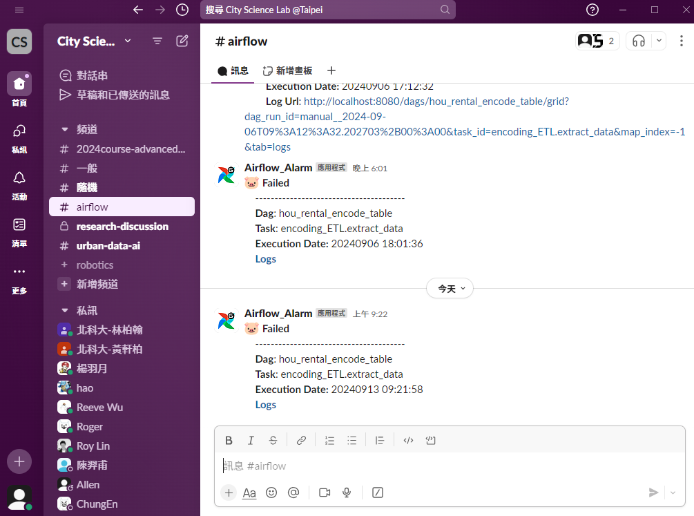

# Airflow 串接 Slack通知教學
> **Author |** Drew　
> **Date |** 2024-09-13

整體來說雖然步驟和介面稍微複雜，但唯一可能踩坑的點應該是隨著Airflow版本不同，呼叫的hook的所需參數也不同，初步整理如下。

## 01 建立 Slack API
由於Slack需要透過API傳送客製化排成與訊息，因此第一步我們需要先至Slack創建屬於自己的App(API)。而好消息是，Slack在這方面的官網教學資源非常豐富，Airflow也有對應的教學資源，基本上不用擔心。不用是管理員，個人帳號也可以自己建立Webhook。參考以下文章，透過官網建立API。

**教學文章｜**[Slack API 官方教學](https://api.slack.com/messaging/webhooks)

### 01-1 設定Incoming Webhook
參考上方教學文章進行至第三點後，此處可選擇頻道，如下圖。建議可先選擇個人訊息，確認可成功傳送訊息後再請管理員創建頻道進行測試。

> (Note: Slack針對自行建立的API有各種權限設定，大多權限是針對頻道而不是個人私訊，但此處測試過預設設定不受影響，若後續有需求可進一步研究。)

更改圖片

進階：
設定權限
重新設定傳送頻道或私訊

## 02 建立 Airflow Connection
二種方式對應不同的hook
- http
頻道名稱要寫入在`Login`中、密碼另外貼，schema可寫可不寫
- slack_api
須設定

## 03 建立通報訊息與功能
參考來源如下：
複雜版
有系統性的維護時可用

簡單版
直接寫成function後import即可(目前Airflow亦採用此版)

影片
可做為單個DAG的測試，好處是可以看到發送的log，方便進行debug

**關鍵重點**
不同版本Airflow的`SlackWebhookOperator`、`SlackNotifier`，內部所需傳遞的參數也不同，建議開發時於該tooltip中確認(本身就因為傳遞參數錯誤而花了數天不得其門而入)

填寫程式碼內容

進階：
排版格式美化
Slack emoji

## 04 導入與測試

某篇文章提到串接DAG沒有很好的debug流程

單個DAG測試：確認可行
導入至其他DAG作為default argument(或另外寫亦可)
但須留意如果在前期建立DAG時，由於會經常試跑與測試DAG，為避免錯誤回報訊息過多，應於DAG完成並且可運作時再於default argument導入並加上這段