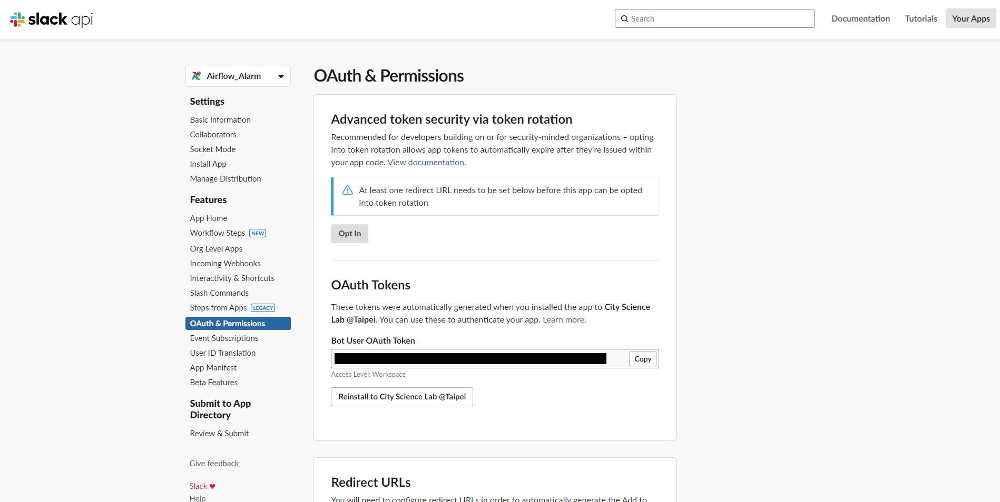

# Airflow 串接 Slack通知教學
> **Author |** Drew　
> **Date |** 2024-09-13

整體來說雖然步驟和介面稍微複雜，但唯一可能踩坑的點應該是隨著Airflow版本不同，呼叫的hook的所需參數也不同，初步整理如下。

## 01 建立 Slack API
由於Slack需要透過API傳送客製化排成與訊息，因此第一步我們需要先至Slack創建屬於自己的App(API)。而好消息是，Slack在這方面的官網教學資源非常豐富，Airflow也有對應的教學資源，基本上不用擔心。不用是管理員，個人帳號也可以自己建立Webhook。參考以下文章，透過官網建立API。

**教學文章｜**[Slack API 官方教學](https://api.slack.com/messaging/webhooks)

### 01-1 設定頻道
參考上方教學文章進行至第三點後，此處可選擇頻道，如下圖。建議可先選擇個人訊息，確認可成功傳送訊息後再請管理員創建頻道進行測試。

> (Note: Slack針對自行建立的API有各種權限設定，大多權限是針對頻道而不是個人私訊，但此處測試過預設設定不受影響，若後續有需求可進一步研究。)

### 01-2 基本資訊設定
創建成功後，基本上只會使用到左側目錄列的三個地方：Basic Information、Install App以及Incoming Webhooks。若第一次設定只需填寫Basic Information即可，

**Settings > Basic Information**

主要設定`App name`、`Description`以及 `App縮圖`，此處App縮圖為自行繪製，可上傳創意頭貼或其他圖片。

**Settings > Install App** (Optional)

設定目前API傳送訊息的**頻道**，若需要切換頻道或有調整API權限可於此選擇 `Reinstall to ...`重新選擇頻道與相關設定。

**Features > Incoming Webhooks**

此處Webhook URL是後續Airflow設定所需之資訊，建議可先複製起來待會使用。

## 02 建立 Airflow Connection
Airflow部分有二種方式可對應不同的hook，一種為`HTTP Webhook`，一種則是`SlackNotifier`。網路上多數教學文章以HTTP Webhook為主，但二種皆可傳送訊息但Airflow Connection設定、Function內寫法略有出入，可於下方參考各自來源解說。

### 02-1 新增Connection
於Airflow上方點擊 Admin > Connection

新增new record

**HTTP版本**

- Connection id: 這個Connection的名稱(可與Slack API不同，後續會做為Python的參數導入)
- Connection type: 點選HTTP
- Host:Webhook URL的網址前半部(到Service結束)
- Login: 預計傳送訊息的頻道名稱 (測試過有無#都可成功)
- Password: Webhook URL的後半部('Service/' 之後)

(schema可寫可不寫)

完成後點選`save`即可新增，完成設定。
頻道名稱要寫入在`Login`中、密碼另外貼，

**SlackNotifier版本**

**參考影片｜**[SlackNotifier教學](https://www.youtube.com/watch?v=4yQJWnhKEa4)
於Slack API的頁面中，找到 Features > OAuth & Permissions

## 03 建立通報訊息與功能
參考來源如下：
複雜版
有系統性的維護時可用

簡單版
直接寫成function後import即可(目前Airflow亦採用此版)

影片
可做為單個DAG的測試，好處是可以看到發送的log，方便進行debug

**關鍵重點**
不同版本Airflow的`SlackWebhookOperator`、`SlackNotifier`，內部所需傳遞的參數也不同，建議開發時於該tooltip中確認(本身就因為傳遞參數錯誤而花了數天不得其門而入)

填寫程式碼內容

進階：
排版格式美化
Slack emoji

## 04 導入與測試

某篇文章提到串接DAG沒有很好的debug流程

單個DAG測試：確認可行
導入至其他DAG作為default argument(或另外寫亦可)
但須留意如果在前期建立DAG時，由於會經常試跑與測試DAG，為避免錯誤回報訊息過多，應於DAG完成並且可運作時再於default argument導入並加上這段

## 附錄：參考文章

1. [Airflow callbacks to Slack notifications for DAG monitoring and alerting](https://alirezasadeghi1.medium.com/airflow-callbacks-to-slack-notifications-for-dag-monitoring-and-alerting-9694e76d805f)
2. 