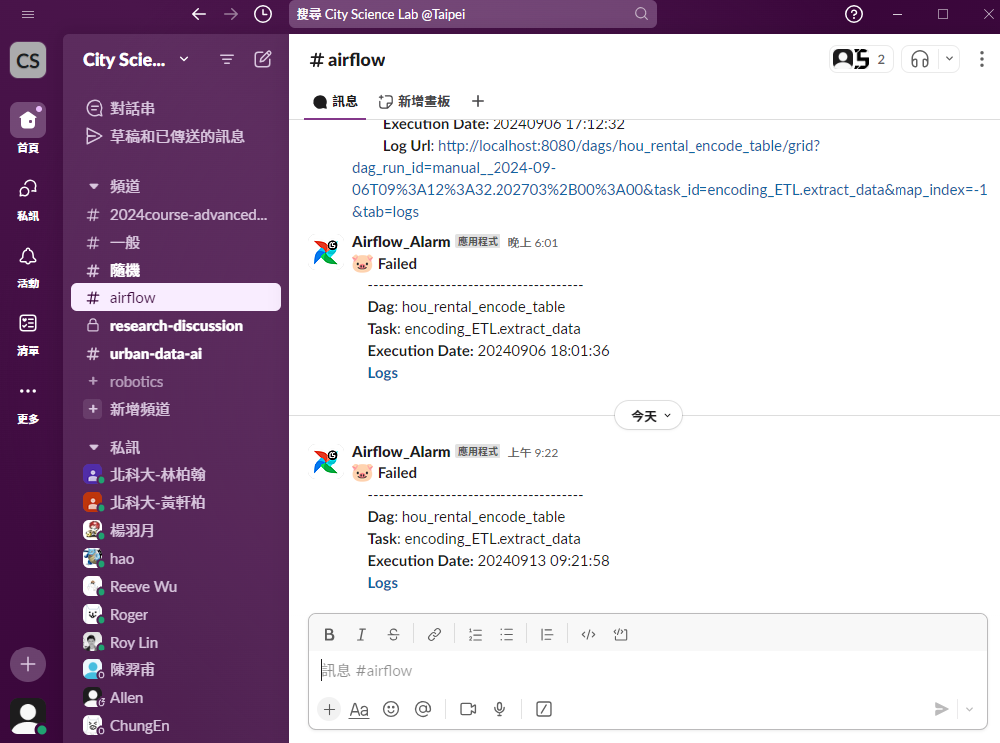
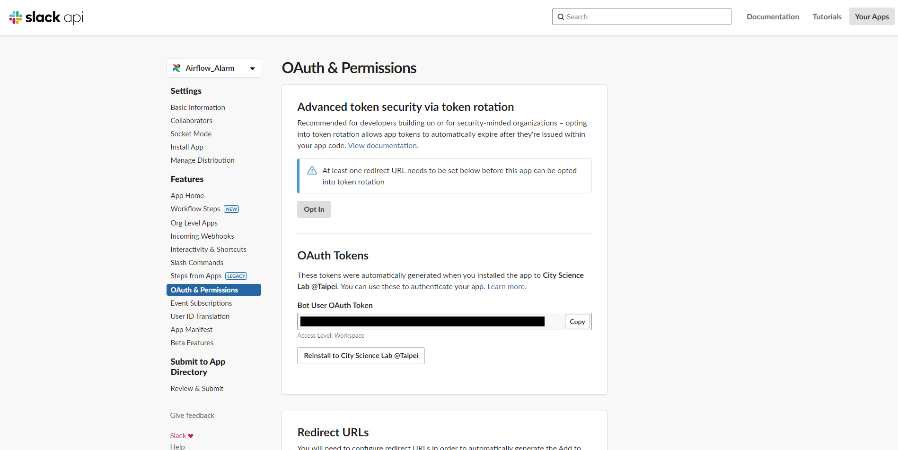
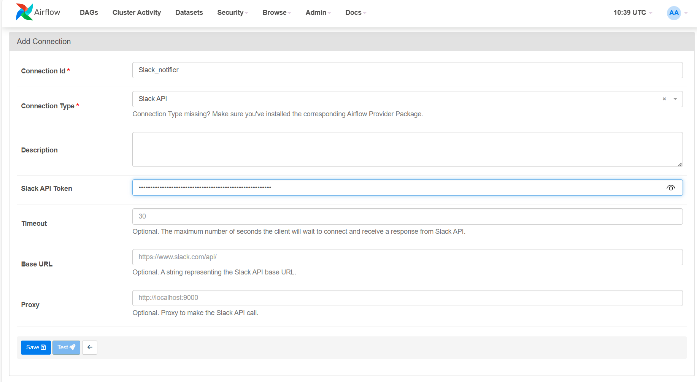
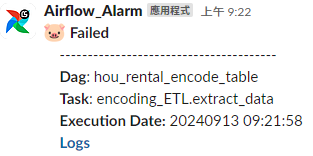
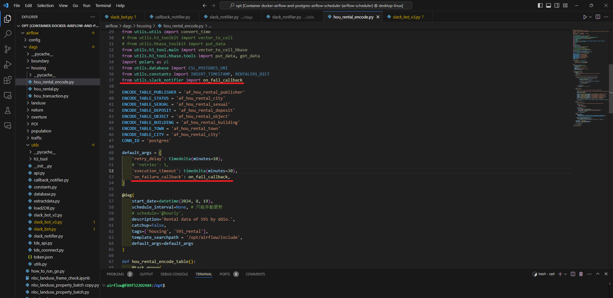
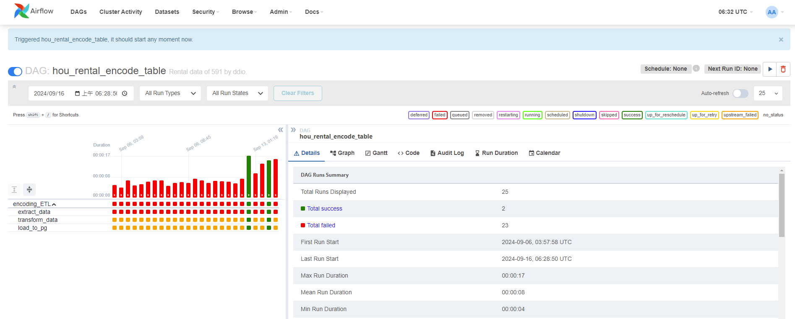

# Airflow 串接 Slack通知教學
> **Author |** Drew　
> **Date |** 2024-09-13

整體來說雖然步驟和介面稍微複雜，但唯一可能踩坑的點應該是隨著Airflow版本不同，呼叫的hook的所需參數也不同，初步整理如下。


## 01 建立 Slack API
由於Slack需要透過API傳送客製化排成與訊息，因此第一步我們需要先至Slack創建屬於自己的App(API)。而好消息是，Slack在這方面的官網教學資源非常豐富，Airflow也有對應的教學資源，基本上不用擔心。不用是管理員，個人帳號也可以自己建立Webhook。參考以下文章，透過官網建立API。

**教學文章｜**[Slack API 官方教學](https://api.slack.com/messaging/webhooks)

### 01-1 設定頻道
參考上方教學文章進行至第三點後，此處可選擇頻道，如下圖。建議可先選擇個人訊息，確認可成功傳送訊息後再請管理員創建頻道進行測試。

> (Note: Slack針對自行建立的API有各種權限設定，大多權限是針對頻道而不是個人私訊，但此處測試過預設設定不受影響，若後續有需求可進一步研究。)


### 01-2 基本資訊設定
創建成功後，基本上只會使用到左側目錄列的三個地方：Basic Information、Install App以及Incoming Webhooks。若第一次設定只需填寫Basic Information即可，

**Settings > Basic Information**

主要設定`App name`、`Description`以及 `App縮圖`，此處App縮圖為自行繪製，可上傳創意頭貼或其他圖片。


**Settings > Install App** (Optional)

設定目前API傳送訊息的**頻道**，若需要切換頻道或有調整API權限可於此選擇 `Reinstall to ...`重新選擇頻道與相關設定。


**Features > Incoming Webhooks**

此處Webhook URL是後續Airflow設定所需之資訊，建議可先複製起來待會使用。


## 02 建立 Airflow Connection
Airflow部分有二種方式可對應不同的hook，一種為`HTTP Webhook`，一種則是`SlackNotifier`。網路上多數教學文章以HTTP Webhook為主，但二種皆可傳送訊息但Airflow Connection設定、Function內寫法略有出入，可於下方參考各自來源解說。

### 02-1 新增Connection
於Airflow上方點擊 Admin > Connection


新增new record


### 02-2 不同Connection Type選擇

**HTTP版本**

- Connection id: 這個Connection的名稱(可與Slack API不同，後續會做為Python的參數導入)
- Connection type: 點選HTTP
- Host:Webhook URL的網址前半部(到Service結束)
- Login: 預計傳送訊息的頻道名稱 (測試過有無#都可成功)
- Password: Webhook URL的後半部('Service/' 之後)

(schema可寫可不寫)


完成後點選`save`即可新增，完成設定。
頻道名稱要寫入在`Login`中、密碼另外貼，

**SlackNotifier版本**

**參考影片｜**[SlackNotifier教學](https://www.youtube.com/watch?v=4yQJWnhKEa4)

於Slack API的頁面中，找到 Features > OAuth & Permissions



將OAuth這一段Token貼到Airflow的Slack API Token中，下方Timeout與其他維持預設設定。



## 03 建立通報訊息與功能
網路上文章除了前面提到的，依照Connection Type與呼叫的Airflow模組(`HTTP Webhook`、`SlackNotifier`)不同外，功能的寫法也有簡易版(單純寫function然後import)與複雜版(寫Class然後進一步依照訊息狀態做出區隔)的不同。

目前CSL的Airflow採用KISS原則(Keep it simple, stupid)，選擇簡易版的作法。後續若隨著資料庫需求增加，可考慮換成複雜版Class的寫法，方便後續依照使用情境進行通知設定。

### 關鍵重點: 確認模組所需傳遞的參數與名稱
由於Airflow版本不同，模組所需傳遞的參數名稱也不同。網路上的教學較少提及採用的Airflow版本，也因此導致直接參考時容易出錯。建議後續在串接時，先於該tooltip中確認導入模組的參數再進行設定。


### 03-1 HTTP Webhook 簡易版
**參考文章｜**
[Automated Alerts for Airflow with Slack](https://towardsdatascience.com/automated-alerts-for-airflow-with-slack-5c6ec766a823)

直接寫成function後import即可(目前Airflow亦採用此版)，基本上只有二步驟，後續若要調整訊息內容或除錯都很方便：
1. 在utils資料夾新增Python檔案並新增function
2. 於DAG的argument導入該function

**1.在utils資料夾新增Python檔案並新增function**
```
from airflow.providers.slack.operators.slack_webhook import SlackWebhookOperator
from airflow.utils.context import Context
import pytz

SLACK_CONN_ID = "airflow_alerts" #Airflow設定的Connection名稱
SLACK_CHANNEL = "airflow" #Slack要發送訊息的頻道名稱，若為個人私訊可不用設定

def on_fail_callback(context: Context, **kwargs):

    local_dt = context.get('execution_date').astimezone(pytz.timezone('Asia/Taipei'))
    options = {
        'icon': ':pig:',
        'title': 'Failed'
    }
    options.update(kwargs)
    slack_message = """
    {icon} *{title}*
    ---------------------------------------
    *Dag*: {dag}
    *Task*: {task}
    *Execution Date:* {execution_date}
    <{log_url}|*Logs*>
    """.format(
        icon=options['icon'],
        title=options['title'],
        dag=context.get('task_instance').dag_id,
        task=context.get('task_instance').task_id,
        execution_date=local_dt.strftime('%Y%m%d %H:%M:%S'),
        log_url=context.get('task_instance').log_url
    )        

    # Use SlackWebhookOperator to send message
    slack_alert = SlackWebhookOperator(
        task_id='send_slack_message',
        slack_webhook_conn_id=SLACK_CONN_ID,
        message=slack_message,
        channel=SLACK_CHANNEL
    )
slack_alert.execute(context)
```

**2.於DAG的argument導入該function**

有二種方式可以導入該模型，一種是在default_args導入，一種是在@dag的前方參數部分傳入，二者擇一即可。
```
default_args = {
    ...
    'on_failure_callback': on_fail_callback,
}
```
```
@dag(
    ...
    on_failure_callback = on_fail_callback,
    default_args=default_args
)
```

### 03-2 HTTP Webhook 複雜版
**參考文章｜**
[Airflow callbacks to Slack notifications for DAG monitoring and alerting](https://alirezasadeghi1.medium.com/airflow-callbacks-to-slack-notifications-for-dag-monitoring-and-alerting-9694e76d805f)

針對不同情境設定不同通知(alert/info/warning)，有系統性的維護時可用。
此處由於拆分檔案較多，不另貼上程式碼。

### 03-3 SlackNotifier
**參考影片｜**
[How to Add Slack Notifications to Your Airflow DAG's with Airflow Notifiers!](https://www.youtube.com/watch?v=4yQJWnhKEa4)

使用`SlackNotifier`進行串接。下方範例可做為單個DAG的測試，可以看到過程中的log(如:Connection設定錯誤等)，方便進行debug。

```
from airflow.decorators import dag, task
from pendulum import datetime
from airflow.providers.slack.notifications.slack_notifier import SlackNotifier

SLACK_CONN_ID = "slack_report_slackapi"
SLACK_CHANNEL = "airflow"
SLACK_MESSAGE = """
    Hello! The {{ ti.task_id}} task is saying hi :wave:
    Today is the {{ ds }} and this task finished with the state: {{ ti.state }} :tada:.
"""

@dag(
    start_date=datetime(2024, 9, 3),
    schedule=None,
    catchup=False,
    tags=["NOtifier", "Slack"]
)

def notifier_slack():
    @task(
        on_success_callback=SlackNotifier(
            slack_conn_id=SLACK_CONN_ID,
            text=SLACK_MESSAGE,
            channel=SLACK_CHANNEL,
        )
    )
    def post_to_slack():
        return 10
    
    post_to_slack()

notifier_slack()
```

**進階**

訊息部分的排版格式可以再優化，部分Slack emoji也可進行替換。訊息部分如下圖。

```
options = {
        'icon': ':pig:', #icon可換成其他Slack emoji
        'title': 'Failed' #Title文字可再調整
    }
slack_message = """
    {icon} *{title}*
    ---------------------------------------
    *Dag*: {dag}
    *Task*: {task}
    *Execution Date:* {execution_date}
    <{log_url}|*Logs*>
    """.format(
        icon=options['icon'],
        title=options['title'],
        dag=context.get('task_instance').dag_id,
        task=context.get('task_instance').task_id,
        execution_date=local_dt.strftime('%Y%m%d %H:%M:%S'),
        log_url=context.get('task_instance').log_url #回傳Server上log的網址，登入後可查看
    ) 
```

## 04 導入與測試
基本上完成功能建置後，只需要在對應的DAG中進行導入即可。如前所述，一種是在default_args導入，一種是在@dag的前方參數部分傳入，二者擇一。
```
default_args = {
    ...
    'on_failure_callback': on_fail_callback,
}
```
```
@dag(
    ...
    on_failure_callback = on_fail_callback,
    default_args=default_args
)
```

此處以hou_rental_encode為例，import對應功能並新增對應參數。在DAG執行失敗時，就可以收到失敗的訊息(如下圖)






### Note: 如何除錯 

某篇文章提到串接DAG沒有很好的debug流程，主要原因是只有DAG層級會有log紀錄，但如果單純功能無法使用並不會有對應的log。詳細內容可參考[此篇文章](https://medium.com/towards-data-engineering/how-to-integrate-slack-notifications-with-airflow-tested-2023-5b31c4cc7ce3#1620)

該文章內提到有四個步驟可以測試是哪一段出問題，詳細如下。但個人建議可以**直接透過03-3提到的SlackNotifier，建立測試用DAG並查看log資訊**，在後續除錯上就可以看到對應的錯誤資訊了。


**Troubleshooting**

Sadly, there are no troubleshooting steps, as I was not able to see any logs at DAG level when the utility was failing and I was not getting notified on Slack. The trick was to test each step independently.

1. Test if your webhook is able to send messages to the Slack Channel using the curl command.
2. Test if your airflow connection for the slack webhook is setup properly
3. Start with very basic message string
4. Make sure you are using correct connection ID in your utility script


到此大致上功能告一段落，後續可依照個人需求，調整訊息格式或排版，讓每天的例行DAG通知不會塞滿整個對話視窗，這應該會是第二步更進階的挑戰了。僅此紀錄。